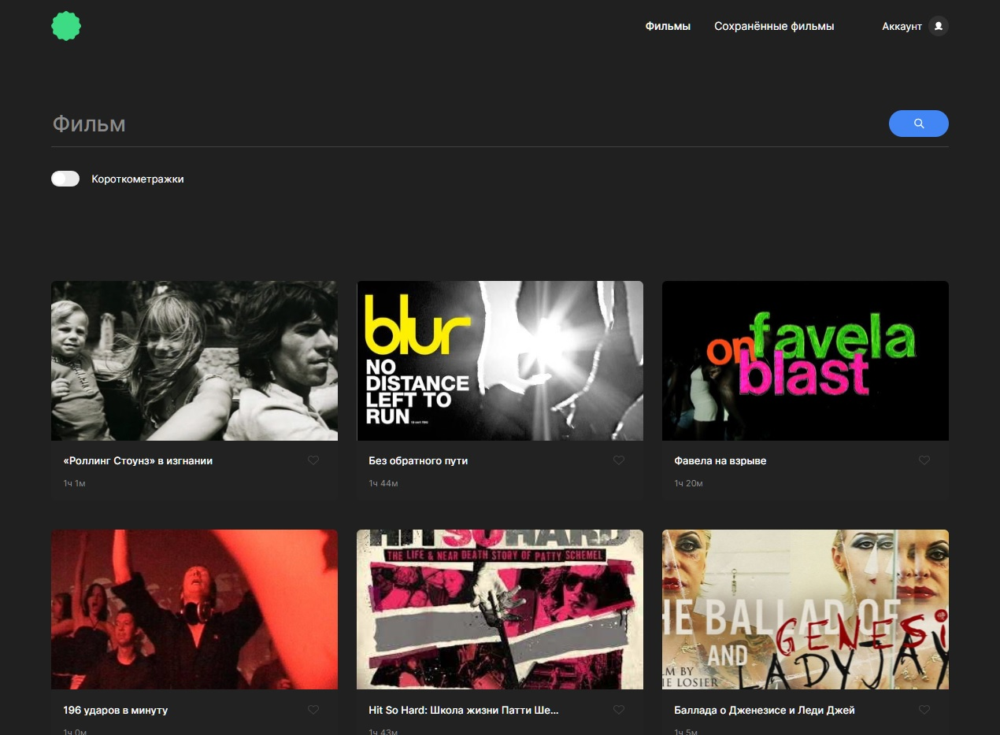
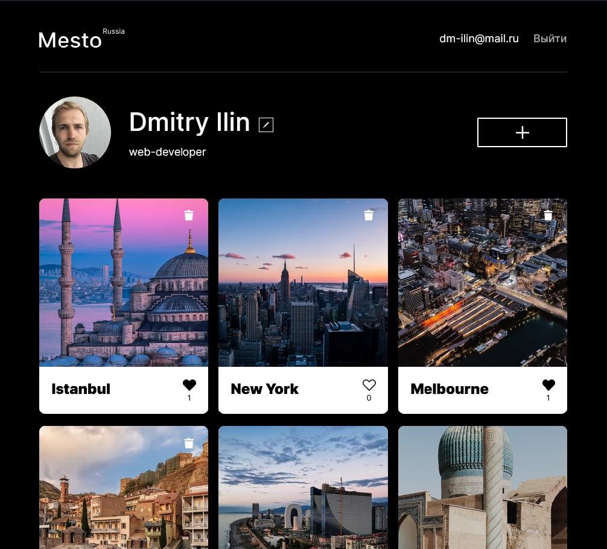

<h1 align="center" style="color: white;">ℍ𝕚 𝕥𝕙𝕖𝕣𝕖! 𝕄𝕪 𝕟𝕒𝕞𝕖 𝕚𝕤 𝔻𝕞𝕚𝕥𝕣𝕪  👋 </h1>

<h3 style="margin-top: 16px;"> 🅿🅰🆂🆂🅸🅾🅽🅰🆃🅴 </h3>

<h2 style='margin-bottom: 0;'>About me</h2>

During the pandemic in 2020 I decided to change my life completely, so here am I. I have recently finished my one-year courses. It was a breathtaking journey through web technologies universe. And now I'm eager to create!

<h2 style='margin-bottom: 0;'>Contact me</h2>
<h5>E-mail: <a href="mailto:dm-ilin@mail.ru" target="_blank">dm-ilin@mail.ru</a></h5>
<h5>Telegram: <a href="https://t.me/dmitri_ilin" target="_blank">@dmitri_ilin</a></h5>

<h2 style='margin-bottom: 0;'>My stack</h2>

    
    
    
     
     
     
     
     
     
     
    
    
    

<h2>My recent projects</h2>

<h3>Movies. Frontend(React) + backend(Node.js/Express/MongoDB)</h3>

<a href="https://mesto.dmilin.nomoredomains.sbs/" target="_blank">Link to the site</a>

<a href="https://github.com/Ilin-Dmitry/movies-explorer-frontend" target="_blank">Link to the repository</a>

Проект является демонстрацией сервиса по поиску фильмов. Пользователь может найти фильм из базы, предоставляемой сторонним API. Предоставляется возможность отфильтровать результаты, добавить понравившиеся карточки в свой профиль или наоборот удалить их. Также можно редактировать данные своего профиля. Незарегистрированным пользователям доступна главная страница с описанием проекта и информацией об авторе. Frontend создан с использованием фреймворка React, backend построен на Node.js/Express/MongoDB/pm2/Nginx.

 
<h3>Mesto. Frontend(React) + backend(Node.js/Express/MongoDB)</h3>

<a href="https://mesto.dm-ilin.nomorepartiesxyz.ru/" target="_blank">Link to the site</a>

<a href="https://github.com/Ilin-Dmitry/react-mesto-api-full" target="_blank">Link to the repository</a>

Проект демонстрирует функционал соц.сети, предоставляющей возможность зарегистрированным пользователям делиться своими фотографиями, ставить/удалять лайки, удалять свои карточки, редактировать данные своего профиля. Frontend создан с использованием фреймворка React, backend построен на Node.js/Express/MongoDB/pm2/Nginx.

 
<h3>Russian Travel(HTML/CSS)</h3>

<a href="https://ilin-dmitry.github.io/russian-travel/index.html" target="_blank">Link to the site</a>

<a href="https://github.com/Ilin-Dmitry/russian-travel" target="_blank">Link to the repository</a>

Проект о путешествиях по России, в том числе и достаточно непривычным способом - на электричках. Проект содержит ссылки на полезные ресурсы, которые могут пригодиться при организации путешествия - карты, расписание ЖД транспорта, сервис бронирования проживания и т.д. Это адаптивный сайт с изменениями сетки в четырех контрольных точках. Реализован с использованием flexbox и grid. Верстка осуществлялась по стандарту БЭМ (Nested).

<!--
**Ilin-Dmitry/ilin-dmitry** is a ✨ _special_ ✨ repository because its `README.md` (this file) appears on your GitHub profile.

Here are some ideas to get you started:

- 🔭 I’m currently working on ...
- 🌱 I’m currently learning ...
- 👯 I’m looking to collaborate on ...
- 🤔 I’m looking for help with ...
- 💬 Ask me about ...
- 📫 How to reach me: ...
- 😄 Pronouns: ...
- ⚡ Fun fact: ...
-->
